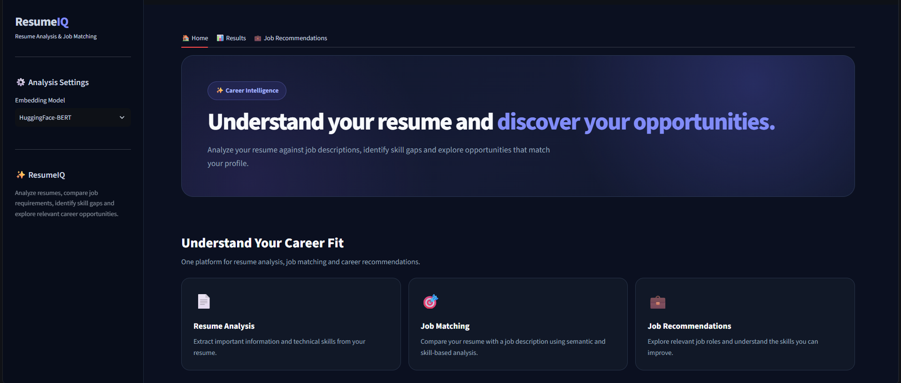
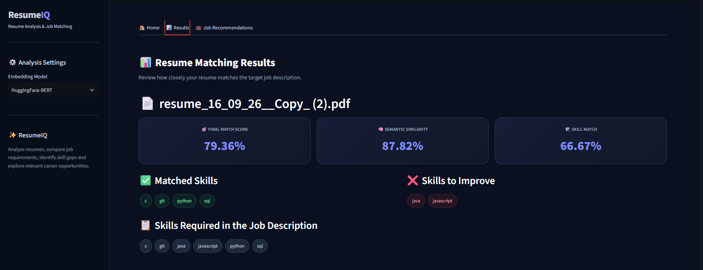
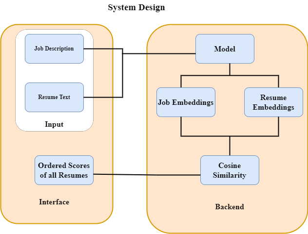

# ResumeIQ – Resume Analysis and Job Recommendation System

[](https://www.python.org/)
[](https://streamlit.io/)
[](https://huggingface.co/)
[](https://pytorch.org/)
[](LICENSE)

An intelligent, NLP-powered career intelligence application that parses resumes, computes semantic similarity against job descriptions using transformer embeddings, extracts technical skills, detects skill gaps, and recommends matching career opportunities.

---

## 1. Project Overview

**ResumeIQ** is an end-to-end Machine Learning and Natural Language Processing (NLP) solution designed to bridge the gap between job seekers and recruiters. By evaluating candidate resumes against target job descriptions using both deep semantic understanding (BERT sentence embeddings) and granular technical skill matching, ResumeIQ delivers accurate compatibility scores, actionable skill gap insights, and intelligent job recommendations.

The system features an interactive, dark-themed **Streamlit** dashboard as well as a scriptable **CLI mode** for batch and automated screening.

---

## 2. Problem Statement

Traditional keyword-based Applicant Tracking Systems (ATS) frequently fail because:

1. **Keyword Rigidity**: Candidates with equivalent experience might use synonyms (e.g., "Deep Learning" vs. "Neural Networks") that simple string matching misses.
2. **Lack of Context**: Simple keyword counts ignore semantic context, project experience depth, and relevance.
3. **No Actionable Feedback**: Job seekers rarely receive concrete feedback explaining why their resume did not match or which specific technical skills they need to acquire.
4. **Disjointed Job Discovery**: Candidates must manually search through hundreds of job listings to identify roles matching their specific skill set.

**ResumeIQ** solves this by combining transformer-based contextual semantic similarity with explicit technical skill extraction, providing transparent hybrid scoring and automated job matching.

---

## 3. Key Features

- 📄 **Multi-Resume PDF Ingestion**: Extracts text seamlessly from single or multiple candidate resume PDFs using `pdfplumber`.
- 🧠 **Contextual BERT Embeddings**: Computes 512-dimensional document embeddings using `sentence-transformers/bert-base-nli-mean-tokens`.
- 🛠️ **Automated Technical Skill Extraction**: Scans resume and job description text for 45+ technical competencies spanning programming languages, ML/DL frameworks, databases, and cloud platforms.
- 🎯 **Hybrid Compatibility Scoring**: Combines **60% Semantic Similarity** (Cosine Similarity) with **40% Technical Skill Overlap** to ensure holistic matching.
- 📊 **Granular Skill Gap Analysis**: Categorizes skills into **Matched Skills** (strengths) and **Skills to Improve** (missing prerequisites).
- 💼 **Intelligent Job Recommendation**: Evaluates candidate profiles against a database of open roles and ranks matching opportunities.
- 🖥️ **Modern Interactive UI**: High-performance Streamlit interface with responsive dark mode cards, real-time feedback, and tabbed navigation.
- ⚡ **CLI Automation**: Supports direct command-line execution for rapid batch resume evaluation.

---

## 4. Application Workflow

```text
       Candidate Resume (PDF)                 Target Job Description (Text)
                 │                                           │
                 ▼                                           ▼
      PDF Text Extraction                         Text Sanitization & Ingestion
                 │                                           │
                 ├─────────────────────┬─────────────────────┤
                 │                     │                     │
                 ▼                     ▼                     ▼
     HuggingFace BERT Model    Skill Extractor       Doc2Vec Engine (Optional)
     (Mean-Pooled Embeddings)  (Regex Boundary)      (Dense Document Vectors)
                 │                     │                     │
                 ▼                     ▼                     │
         Cosine Similarity        Skill Overlap              │
          (Semantic Score)        (Skill Score)              │
                 │                     │                     │
                 └──────────┬──────────┘                     │
                            │                                │
                            ▼                                │
                 Hybrid Compatibility Score ◄────────────────┘
                (60% Semantic + 40% Skill)
                            │
            ┌───────────────┴───────────────┐
            │                               │
            ▼                               ▼
   Candidate Matching Report        Job Recommendation Engine
  - Final Match Percentage         - Matches Against Database (jobs.csv)
  - Matched vs Missing Skills      - Ranked Fit Scores & Recommendations
  - Skill Gap Improvement Plan     - Candidate Readiness Assessment
```

---

## 5. Technology Stack

| Layer                         | Technologies                                               |
| ----------------------------- | ---------------------------------------------------------- |
| **Core Language**       | Python 3.10 / 3.11                                         |
| **NLP & Deep Learning** | Hugging Face Transformers, PyTorch, NLTK, Gensim (Doc2Vec) |
| **Machine Learning**    | Scikit-Learn (`cosine_similarity`), NumPy, Pandas        |
| **Document Processing** | `pdfplumber`                                             |
| **Web Framework & UI**  | Streamlit                                                  |
| **Testing & Quality**   | `unittest`, `pytest`                                   |

---

## 6. Machine Learning/NLP Techniques Used

### 1. BERT-Based Sentence Embeddings

ResumeIQ utilizes the pretrained `sentence-transformers/bert-base-nli-mean-tokens` model from Hugging Face. The model produces contextual token representations for input sequences up to 512 tokens.

### 2. Attention-Weighted Mean Pooling

Token embeddings from BERT's final hidden state are aggregated into a single document-level vector using mean pooling weighted by the model's attention mask:

$$
\mathbf{u} = \frac{\sum_{i=1}^{N} \mathbf{h}_i \cdot m_i}{\sum_{i=1}^{N} m_i}
$$

Where $\mathbf{h}_i$ is the $i$-th token representation and $m_i \in \{0, 1\}$ is the attention mask indicating non-padding tokens.

### 3. Cosine Semantic Similarity

Semantic similarity between the resume vector $\mathbf{u}$ and the job description vector $\mathbf{v}$ is calculated as:

$$
\text{Semantic Score} = \left( \frac{\mathbf{u} \cdot \mathbf{v}}{\|\mathbf{u}\| \|\mathbf{v}\|} \right) \times 100
$$

### 4. Technical Skill Extraction & Gap Identification

Using compiled word-boundary regular expressions, technical entities are recognized across languages (Python, Java, C++, TypeScript), frameworks (React, PyTorch, TensorFlow, Django), databases (PostgreSQL, MongoDB), and cloud/DevOps tools (AWS, Docker, Git).

The skill match percentage is calculated as:

$$
\text{Skill Score} = \left( \frac{|\text{Resume Skills} \cap \text{JD Skills}|}{|\text{JD Skills}|} \right) \times 100
$$

### 5. Hybrid Scoring Formula

To balance contextual alignment and hard prerequisite fulfillment, ResumeIQ computes:

$$
\text{Final Match Score} = (0.60 \times \text{Semantic Score}) + (0.40 \times \text{Skill Score})
$$

---

## 7. Project Architecture

```text
┌─────────────────────────────────────────────────────────────┐
│                       Presentation Layer                    │
│      Streamlit Web UI (app.py)   │   CLI Runner (app.py)    │
└──────────────────────────────┬──────────────────────────────┘
                               │
┌──────────────────────────────▼──────────────────────────────┐
│                    Application & Logic Layer                │
│                                                             │
│   src/resume_parser.py    ──► PDF / Text Document Ingestion │
│   src/skill_extractor.py  ──► Regex Entity Detection        │
│   src/models.py           ──► BERT & Doc2Vec Vectorization  │
│   src/resume_scanner.py   ──► Hybrid Score & Gap Analysis   │
│   src/job_recommender.py  ──► Ranked Database Matching      │
│   src/utils.py            ──► Safe File & Path Resolution   │
└──────────────────────────────┬──────────────────────────────┘
                               │
┌──────────────────────────────▼──────────────────────────────┐
│                         Data Layer                          │
│          data/jobs.csv  │  Pretrained Hugging Face Hub      │
└─────────────────────────────────────────────────────────────┘
```

---

## 8. Folder Structure

```text
ResumeIQ/
│
├── app.py                      # Main Streamlit web application & CLI entrypoint
├── application.py              # Backward-compatibility wrapper
├── requirements.txt            # Pinned project dependencies
├── README.md                   # Comprehensive project documentation
├── LICENSE                     # MIT Open-Source License
├── .gitignore                  # Git ignore rules for Python & OS files
│
├── src/                        # Modular source package
│   ├── __init__.py             # Package exports & version metadata
│   ├── models.py               # BERT model caching, mean pooling, cosine similarity
│   ├── resume_parser.py        # PDF & text file extraction functions
│   ├── skill_extractor.py      # Technical skills catalog & regex extraction
│   ├── resume_scanner.py       # Hybrid resume-JD comparison engine
│   ├── job_recommender.py      # Dataset-driven job recommendation logic
│   └── utils.py                # Cross-platform path resolution helpers
│
├── data/
│   └── jobs.csv                # Job listings dataset (Role, Company, Description)
│
├── assets/
│   ├── screenshots/            # UI screenshots for documentation
│   │   ├── home_page.png
│   │   ├── analysis_results.png
│   │   └── workflow.png
│   └── demo_videos/            # Video demonstration guide and recordings
│       └── README.md
│
└── tests/
    ├── __init__.py
    └── test_core.py            # Unit & integration test suite (unittest / pytest)
```

---

## 9. Installation and Setup

### Prerequisites

- Python 3.10 or 3.11 installed
- Git installed

### 1. Clone the Repository

```bash
git clone https://github.com/your-username/ResumeIQ.git
cd ResumeIQ
```

### 2. Create and Activate a Virtual Environment

**On Windows (PowerShell):**

```powershell
python -m venv .venv
.\.venv\Scripts\Activate.ps1
```

**On Windows (Command Prompt):**

```cmd
python -m venv .venv
.\.venv\Scripts\activate.bat
```

**On macOS / Linux:**

```bash
python3 -m venv .venv
source .venv/bin/activate
```

### 3. Install Dependencies

```bash
pip install --upgrade pip
pip install -r requirements.txt
```

---

## 10. Requirements

Key dependencies listed in `requirements.txt`:

```text
streamlit>=1.30.0
transformers>=4.35.0
torch>=2.0.0
pdfplumber>=0.10.0
nltk>=3.8.0
gensim>=4.3.0
scikit-learn>=1.3.0
pandas>=2.0.0
numpy>=1.24.0
pytest>=7.0.0
```

---

## 11. How to Run the Application

### Option A: Launch Interactive Web Application

```powershell
streamlit run app.py
```

*The web interface will open automatically in your browser at `http://localhost:8501`.*

### Option B: Run via Command-Line Interface (CLI)

You can directly compare a resume PDF against a job description text file:

```powershell
python app.py path/to/resume.pdf path/to/job_description.txt
```

### Option C: Run Automated Tests

```powershell
python -m unittest discover -s tests
```

---

## 12. How to Use the Application

1. **Upload Resume**: In the **🏠 Home** tab, drag and drop one or multiple candidate resume PDFs.
2. **Enter Job Description**: Paste the target role requirements or job description in the text box.
3. **Run Analysis**: Click **🚀 Analyze Resume**. The system extracts text and highlights all detected technical competencies.
4. **Inspect Compatibility**: Navigate to the **📊 Results** tab to review:
   - Final Match Score
   - BERT Semantic Similarity Score
   - Technical Skill Match Score
   - Matched Skills vs. Skills to Improve
5. **Explore Career Matches**: Open the **💼 Job Recommendations** tab, choose your resume, and click **🔎 Find Matching Jobs** to discover top-ranked opportunities from the job catalog.

---

## 13. Screenshots

### Home Screen & Resume Upload



### Resume Matching & Skill Gap Results



### System Architecture & Workflow



---
## 14. Example Input and Output

### Example Input

- **Resume Text**:
  > "Senior Machine Learning Engineer with 4 years experience in Python, PyTorch, Scikit-learn, SQL, and Docker. Built end-to-end NLP pipelines and deployed REST APIs."
  >
- **Target Job Description**:
  > "Looking for an ML Engineer proficient in Python, Machine Learning, NLP, SQL, Pandas, NumPy, Scikit-learn, TensorFlow, and Git."
  >

### Example Output Data Structure

```json
{
  "final_score": 65.31,
  "semantic_score": 86.62,
  "skill_score": 33.33,
  "matched_skills": [
    "machine learning",
    "nlp",
    "python",
    "scikit-learn",
    "sql"
  ],
  "missing_skills": [
    "git",
    "numpy",
    "pandas",
    "tensorflow"
  ],
  "resume_skills": [
    "docker",
    "machine learning",
    "nlp",
    "python",
    "pytorch",
    "rest api",
    "scikit-learn",
    "sql"
  ],
  "jd_skills": [
    "git",
    "machine learning",
    "nlp",
    "numpy",
    "pandas",
    "python",
    "scikit-learn",
    "sql",
    "tensorflow"
  ]
}
```

---

## 15. Limitations

- **Predefined Skill Dictionary**: Skill identification relies on a curated list of technical keywords; emerging or niche acronyms may require updating `TECH_SKILLS`.
- **Maximum Sequence Length**: Transformer inputs are truncated at 512 subword tokens per sentence batch.
- **Local Job Catalog**: Job recommendations currently match against local `data/jobs.csv`.

---

## 16. Future Improvements

- [ ] **Live Job API Integration**: Connect to LinkedIn, Indeed, or Adzuna APIs for real-time live job matching.
- [ ] **Dynamic NER Model**: Train a custom spaCy or BERT Named Entity Recognition (NER) model for open-vocabulary skill and entity discovery.
- [ ] **Automated Resume Tailoring**: LLM-powered suggestions for rephrasing bullet points to better target specific job descriptions.
- [ ] **Exportable PDF Reports**: Downloadable candidate diagnostic reports with skill improvement roadmaps.

---

## 17. Contribution Guidelines

Contributions are welcome! Please follow these steps:

1. Fork the repository.
2. Create a feature branch (`git checkout -b feature/AmazingFeature`).
3. Commit your changes (`git commit -m 'Add AmazingFeature'`).
4. Run test suite (`python -m unittest discover -s tests`).
5. Push to the branch (`git push origin feature/AmazingFeature`).
6. Open a Pull Request.

---

## 18. License

Distributed under the **MIT License**. See [`LICENSE`](LICENSE) for complete details.

---

## 29. Author & Acknowledgements

- **Author**: Mehul Dangda IT'27 @ SKIT Jaipur.
- **Models**: [Hugging Face sentence-transformers](https://huggingface.co/sentence-transformers/bert-base-nli-mean-tokens)
- **Frameworks**: [Streamlit](https://streamlit.io/), [PyTorch](https://pytorch.org/), [Scikit-learn](https://scikit-learn.org/)
